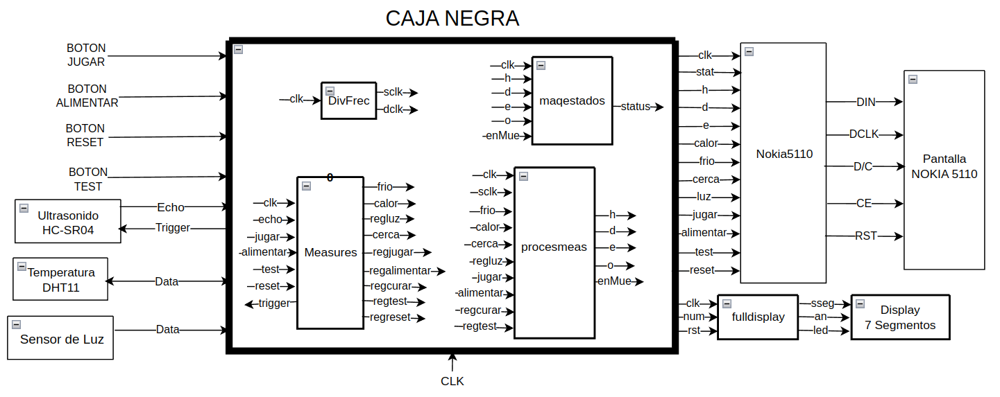
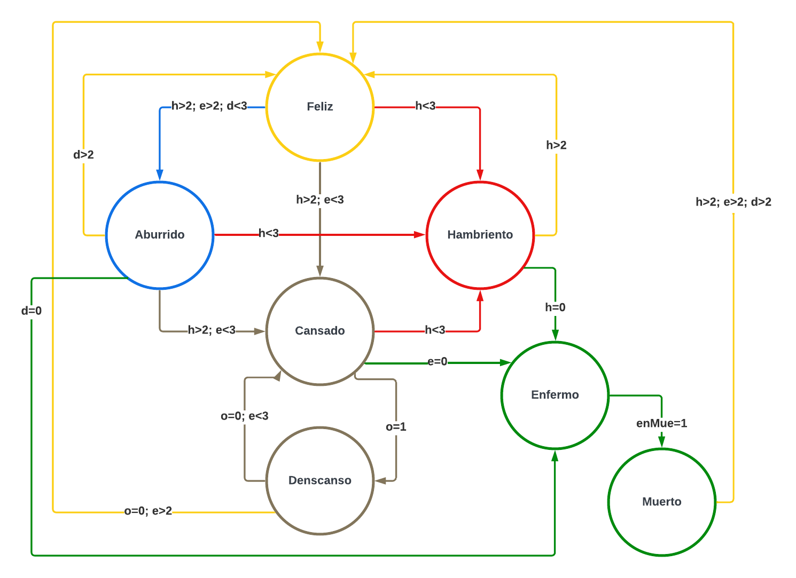
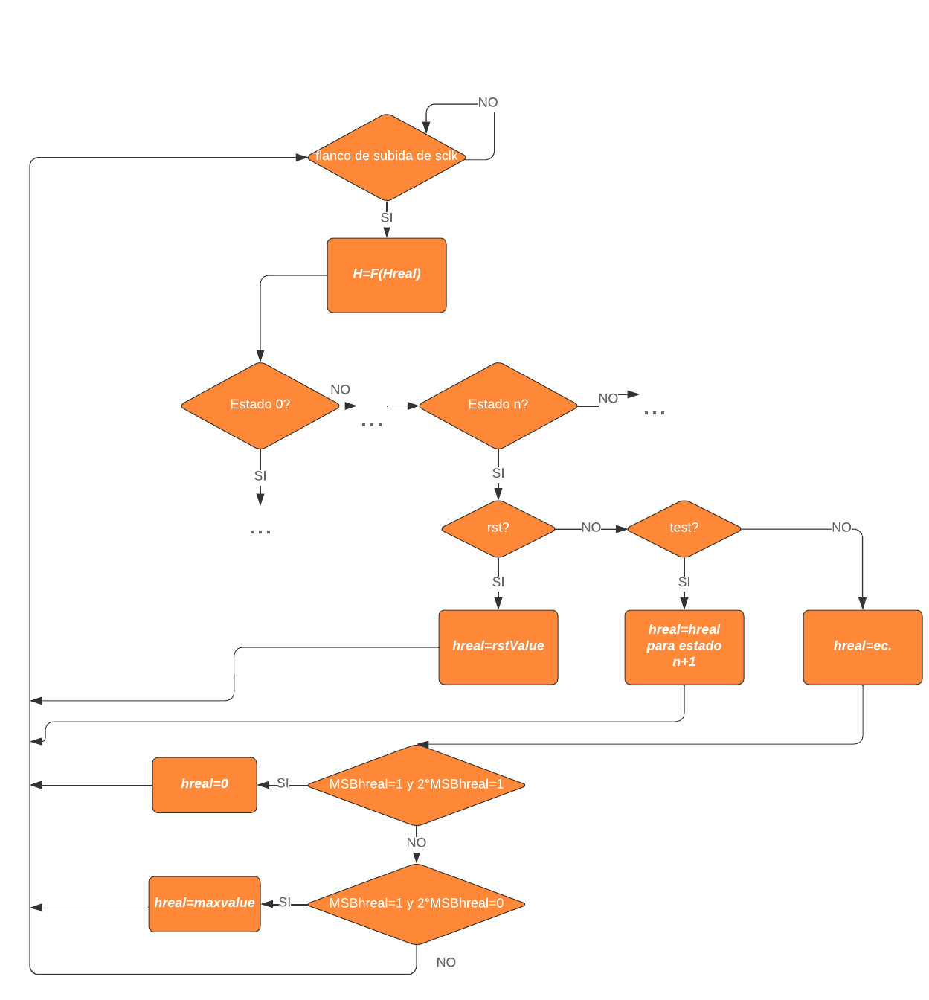
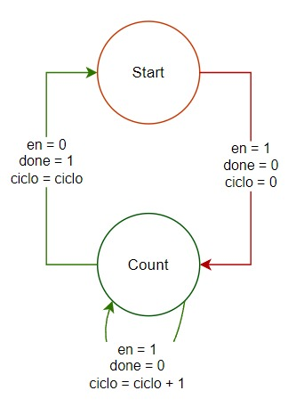
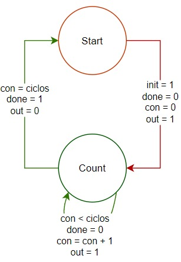
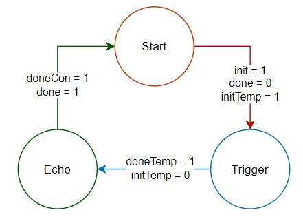
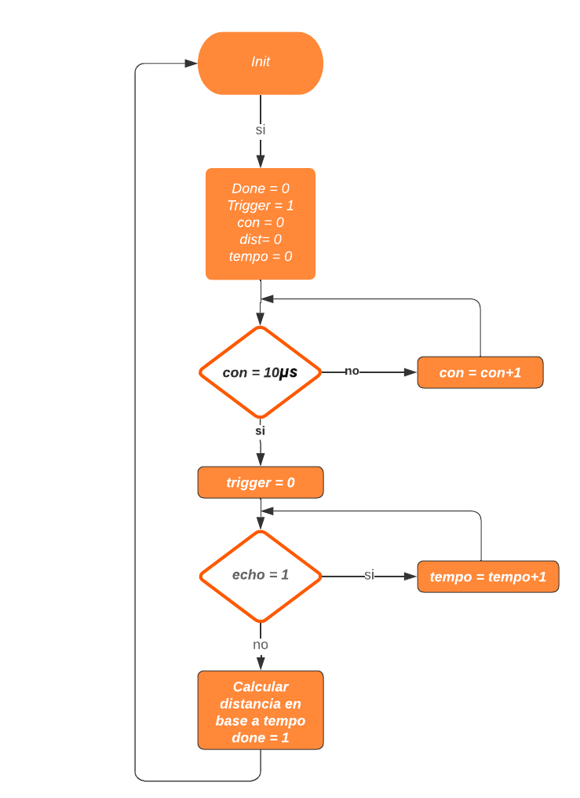
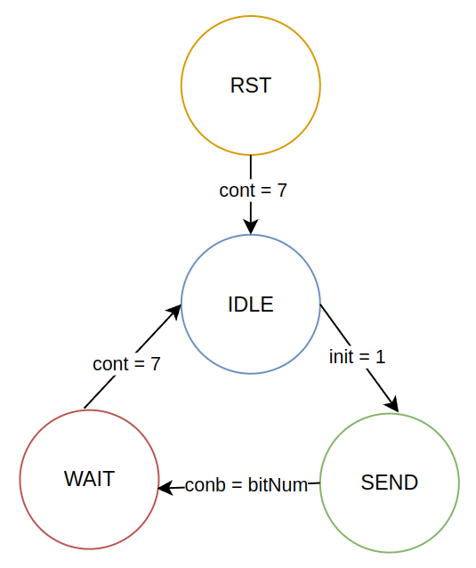

# Entrega 1 del proyecto WP01

### Integrantes:
- Jose Gabriel Peña Solorzano
- Cristian Camilo Barbosa Suarez
- Gabriel Felipe Ostos Iguavita

# Objetivo

Desarrollar un sistema de Tamagotchi en FPGA (Field-Programmable Gate Array) que simule el cuidado de una mascota virtual. El diseño incorporará una lógica de estados para reflejar las diversas necesidades y condiciones de la mascota, junto con mecanismos de interacción a través de sensores y botones que permitan al usuario cuidar adecuadamente de ella.

# 1. Requisitos del sistema

## 1.1 Botones

Planteamos el uso de los siguientes botones para interactuar con el sistema:

- **Reset:** Configura los valores de la mascota en un estado inicial "Feliz" que refleja condiciones optimas y define las variables de diversión, hambre y energia en un valor de 4. Esto se establece luego de pulsar el respectivo boton por 5 segundos.
- **Test:** Activa el modo de prueba al mantener pulsado por al menos 5 segundos, permitiendo al usuario navegar entre los diferentes estados del Tamagotchi con cada pulsación.
- **Jugar:** Simula jugar con la mascota virtual, por lo tanto con una pulsacion aumenta el valor de "Diversion" y disminuye el valor correspondiente a "Energia", simulando cansancio en la mascota.
- **Alimentar:** Simula suministrar alimento a la mascota, por lo que al pulsar el boton aumenta el valor correspondiente a "Hambre", lo que se explica más adelante. 
- **Curar:** Para simular esta acción en la mascota, proponemos pulsar los botones de "Jugar" y "Alimentar" de manera simultanea. La acción de curar solo debe ser posible en el estado "enfermo" y se asemeja al reset en que define las variables de "diversión", "hambre" y "energia" en un valor de 4.

## 1.2 Sistema de Sensado

Para la interacción de Tamagutchi con su entorno, se propone incorporar 3 sensores como lo son:

- **Sensor de Luz o Fotoresistencia(GL5516):** Este sensor nos permite determinar los tiempos en que la mascota estara descansando, si es sometido a luz el Tamagutchi estara despierto, en caso contrario, si esta oscuro o bajo sombra estará dormido. 

- **Sensor Ultrasonido(HC-SR04):** Con este sensor queremos interactuar con el Tamagutchi para cambiar su nivel de "Diversión", si nos ubicamos cerca a la mascota el valor de este item debe conservarse, de lo contrario disminuirá progresivamente.

- **Sensor de Temperatura(DHT11)** Usando este sensor se pueden modificar los niveles de "Hambre" y de "Energia", si la temperatura es muy baja el Tamagutchi sufrirá disminución en su nivel de "Hambre", mientras que si se encuentra a altas temperaturas, la mascota tendra disminución en su valor de "Energia" reflejando cansancio.

## 1.3 Sistema de Visualizacion

Para la visualización del Tamagutchi, la representacion de sus emociones y los valores numéricos representativos de los estados se empleará el display "Nokia 5110", esto permite al usuario entender las necesidades de la mascota virtual y actuar para su bienestar.

# 2. Especificaciones de Diseño

## 2.1 Estados

El Tamagutchi posee la siguiente lógica de estados que representan sus condiciones y necesidades. Los estados son los siguientes:

| **Estado** | **Binario** | **Decimal** |  
|:----------:|:-----------:|:-----------:|
|    Feliz   |     000     |      0      |
|  Aburrido  |     001     |      1      |
|   Cansado  |     010     |      2      |
| Descansando |     011     |      3      |
| Hambriento |     100     |      4      |
|   Enfermo  |     101     |      5      |
|   Muerto   |     110     |      6      |

## 2.2 Variables de transición de estados

Para controlar los cambios de estado definimos las siguientes variables:

- **Diversion(d):** Representa el nivel de diversión de la mascota en una escala de 0 a 5 donde 5 es entretenida y 1 es aburrida. Esta variable aumenta jugando con el tamagutchi; disminuye tras pasar el tiempo sin interactuar con la mascota y se conserva si el usuario le da compañia a la mascota.
- **Hambre(h):** Representa el nivel de hambre de la mascota en una escala de 0 a 5 donde 5 es llena y 1 es hambrienta. Esta variable aumenta alimentando al tamagutchi y disminuye con el tiempo, aumentando la velocidad de disminución en un ambiente frio.
- **Energia(e):** Representa el nivel de energia de la mascota en una escala de 0 a 5 donde 5 es activa y 1 es cansada. Esta variable aumenta con el tiempo mientras el tamagutchi esta en estado "descansando" y disminuye con el tiempo. La velocidad de disminución de esta variable aumenta al jugar con el tamagutchi, en un ambiente caluroso o en un ambiente oscuro.
  
Para las 3 variables ya mencionadas, un nivel de 5, 4 o 3 se consideran optimos y mantienen a la mascota en estado "feliz"; un nivel de 2 o 1 implican una necesidad y fuerzan un cambio de estado según el caso; 0 representa un estado crítico y fuerza a la mascota a pasar a estado "enfermo".

- **Oscuridad(o):** Solo pudiendo tomar valores entre 0 y 1 según el nivel de luz del ambiente. En un estado de "cansado", la oscuridad permite al tamagotchi pasar a estado "descansar". Si la mascota aun tiene energia, aumenta la velocidad de disminución de "energía" para permitirle al tamagotchi descansar.

## 2.3 Acciones/Interacciones:

- **Jugar:** Permite aumentar Diversion pero disminuye Energia.
- **Alimentar:** Disminuye Hambre.
- **Curar:** Permite fijar Diversion, Hambre y Energia en un valor de 4.
- **Luz:** Permite entrar al estado Descansando y disminuye la Energia.
- **Proximidad:** Evita la disminucion de Diversion.
- **Temperatura:** Disminuye la Energia o Hambre segun sea el caso.

## 2.4 Descripcion de estados

A continuación se presentan todos los estados del tamagutchi, con sus respectivas descripciones, condiciones y limitaciones de interacción, es decir, que acciones no se pueden realizar/no se tienen en cuenta en cada estado.

- **Feliz:** Representa el bienestar de la mascota. Implica que las variables diversion, hambre y energia esten todas en un nivel de 3 o superior. En este estado se ignora la accion de Curar.
- **Aburrido:** Representa falta de diversion en la mascota. Implica que el hambre y la energia tengan un nivel de 3 o superior, pero que la diversión este en 2 o en 1. En este estado se ignora la accion de Curar.
- **Cansado:** Representa falta de descanso en la mascota. Implica hambre en un nivel igual o superior a 3, pero de energía en 2 o 1. En este estado se ignoran las acciones de Curar y Jugar.
- **Descansando:** Representa a la mascota dormida. Implica energia en un nivel de 2 o 1 y que el ambiente este oscuro. En este estado se ignoran las acciones de Jugar, Alimentar, Curar ,Proximidad y Temperatura.
- **Hambriento:** Representa falta de alimentación en la mascota. Implica un nivel de hambre de 1 o 2. Ignora las acciones de Curar, Jugar, Oscuridad.
- **Enfermo:** Representa carencia en cualquiera de las necesitades de la mascota. Implica Diversion, Hambre o Energia en un nivel de 0 0.En este estado se ignoran las acciones de Jugar y Alimentar.
- **Muerto:** Luego de cierto tiempo enfermo sin curar a la mascota, esta morirá. En este estado se ignoran todas las acciones, solo siendo posible resetear el tamagutchi.

Notese que existe una jerarquia de necesidades, siendo posible pasar a "hambriento" sin importar el nivel de energia y diversión, permitiendo simplificar la máquina de estados. Esto se ve con mayor claridad en el diagrama de la máquina de estados.

# 3. Arquitectura del sistema

## 3.1 Diagramas de bloques

### 3.1.1 Diagrama general de caja negra

La imagen muestra el diagrama de una caja negra que representa el sistema del Tamagotchi. En el diagrama, se observan varios bloques conectados entre sí que conforman los diferentes módulos y sensores del dispositivo. La caja negra recibe entradas desde botones físicos, como "JUGAR", "ALIMENTAR", "RESET", y "TEST", así como de sensores como un sensor ultrasonido HC-SR04, un sensor de temperatura DHT11 y un sensor de luz. Dentro de la caja negra, se incluyen los módulos de procesamiento, como el módulo "Measures", que recibe señales de los sensores y botones, y el módulo "procesmeas", que realiza un procesamiento adicional de las medidas. También se encuentra un módulo "maqestados" encargado de la lógica de estados del sistema.

El sistema genera salidas hacia una pantalla Nokia 5110 mediante su respectivo controlador. Además, se cuenta con un controlador de display de 7 segmentos que permite ver el estado y el valor de las variables del sistema. Todos los módulos y dispositivos están sincronizados por una señal de reloj (CLK) y otros controladores como "DivFrec" que dividen la frecuencia de reloj para su correcto funcionamiento. Este diseño permite la interacción del usuario con el Tamagotchi a través de sensores y botones, mostrando el estado de la mascota en la pantalla y en los displays visuales.

### 3.1.2 Maquina de estados principal (maqestados)

Recordando que:
- Diversión(d)
- Hambre(h)
- Energia(e)
- Oscuridad(o)

Se aclara además que los botones Test y Reset controlan indirectamente los estados variando unicamente los valores de d, h y e; en vez del estado en sí mismo.

La máquina de estados trabaja 

### 3.1.3 Módulo de toma de mediciones (measure)

Este módulo esta controlado por sclk. Inicializa los sensores y registra sus valores para ser trabajados posteriormente. En el caso de test y reset, solo saca señales de control de tamagotchi cuando los respectivos pulsadores se mantienen presionados por aproximadamente 5 segundos.

### 3.1.3 Procesamiento de mediciones (procesmeas)

Este módulo actualiza valores internos de h, e y d (hreal, ereal y dreal) en base al estado actual y las entradas (sensores y pulsadores) del tamagotchi.

Es necesario hacer una distinción entre h, e y d como registros de 6 posibles valores que representan visualmente el nivel del tamagotchi con hreal, ereal y dreal, que son registros de 8 bits (256 valores) que varian cada ciclo de operación del tamagotchi según las condiciones que este experimente.

Cada ciclo estos registros pueden subir, bajar, forzarse en un valor de reset específico o conservarse en sus valores máximos o mínimos para evitar saturaciones en los registros, que pueden desembocar en que la mascota muera de hambre tras alimentarse demasiado.

## 3.2 Descripcion de componentes

## Subsistemas

### Contador

- **Input:** Clk, enable.
- **Output:** Done, ciclo.

**Especificaciones:**

- Cuenta los ciclos de reloj durante los cuales enable = 1.
- Conserva el dato durante enable = 0.
- Parametro con n cantidad de bits para la salida.

**Maquina de estados:**

### Temporizador

- **Input:** Clk, Init.
- **Output:** Out, Done.
- **Param:** Ciclos.

**Especificaciones:**

- Out es 1 por la cantidad de ciclos especificados al instanciar cada vez que Init = 1.

**Maquina de estados:**

### Divisor de Frecuencia
- **Input:** Clk.
- **Output:** Sclk, Dclk.

**Especificaciones:**

- Sclk debe ser una señal periodica de frecuencia ajustable que tenga una duración corta en alto y larga en bajo, para controlar y coordinar la toma de mediciones de los sensores.
- Dclk debe ser una señal de reloj con frecuencia inferior a 4MHz (especificaciones de la pantalla Nokia5110).

## Ultrasonido(HC-SR04)

- **Input:** Trigger.
- **Output:** Echo.
- **Rango:** 20mm

**Trabajo:**

1. Recibe una senal de trigger en alto por 10us.
2. Realiza la medicion.
3. Envia una senal en alto por echo cuya duracion es proporcional a la distancia medida.

**Especificaciones del driver:**

- Debe tener senales de init y done para facilitar la implementacion.
- Cuando init = 1, realiza una medicion.
- Done = 1 cuando haya terminado de enviar la distancia.
- Como salida entrega el valor de distancia medido en mm y lo guarda hasta que init vuelva a ser 1.

**Maquina de estados:**

**Diagrama de flujo:**

**Diagrama de caja negra:**

**Implementacion:**

1. Distancia critica: 10cm

## Temperatura(DHT11)

- **Inout:** Data
- **Rango:** 0°-50°C

**Trabajo:**

1. Inicializacion

* Master manda un bajo por 18us
* Pull up por 20-40uS
* Slave manda un bajo por 80us 
* Pull up por 80uS

2. Medición

3. Transmisión de datos

* Antes de cada bit, slave manda un bajo por 5Ous 
* 0: un pull up por 26-28us
* 1: un pull up pur 70us

4. Slave manda un bajo por 50us al acabar la transmisión de datos

**Especificaciones del driver:**

* Debe tener init y done para facilitar la implementacion.
* Temperatura como salida con el valor de la temperatura en °C y lo guarda hasta init = 1.

**Implementacion:**

1.Temperatura critica superior: 20°C \
2.Temperatura critica inferior: 15°C

## Sensor de luz (módulo sensor de luz)
- **In:** Data

**Trabajo:**

Este sensor no requiere un driver debido a que el módulo físico ya transmite una señal de un bit según lo que reciba el sensor. La sensibilidad del sensor se puede ajustar con un potenciometro que hace perte del módulo.

## Pantalla(NOKIA 5110)

- **Input:** SDIN = Data, SCLK, D/C = Data/Command, SCE = Chip Enable, RST = Reset, OSC = Oscillator, VLCD = 5Vdc.

**Especificaciones del driver:**

* La pantalla debe mostrar el nivel de energia, hambre y diversion del tamagotchi con el formato: Letra que represente la variable, dos puntos, nivel de la variable, dos puntos, nivel de la variable en forma de numero. Por ejemplo: E: 3, correspondiente al nivel de energia igual a 3.

* Debe mostrar explicitamente el estado del tamagotchi en la zona superior.

* La mascota debe tener caracteristicas visuales unicas para reflejar el estado en el que este.

**Maquina de estados:**

# 4. Implementacion final

El codigo verilog implementado para el desarrollo del prototipo final de la mascota se encuentra en la carpeta **tamagotchi**.
