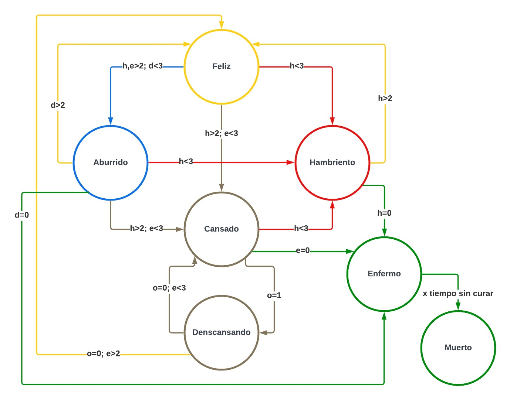

# Entrega 1 del proyecto WP01

### Integrantes:
- Jose Gabriel Peña Solorzano
- Cristian Camilo Barbosa Suarez
- Gabriel Felipe Ostos Iguavita

# Objetivo

Desarrollar un sistema de Tamagotchi en FPGA (Field-Programmable Gate Array) que simule el cuidado de una mascota virtual. El diseño incorporará una lógica de estados para reflejar las diversas necesidades y condiciones de la mascota, junto con mecanismos de interacción a través de sensores y botones que permitan al usuario cuidar adecuadamente de ella.

# 1. Requisitos del sistema

## 1.1 Botones

Planteamos el uso de los siguientes botones para interactuar con el sistema:

- **Reset:** Configura los valores de la mascota en un estado inicial establecido y que refleja condiciones optimas, esto se establece luego de pulsar el boton por 5 segundos.
- **Test:** Activa el modo de prueba al mantener pulsado por al menos 5 segundos, permitiendo al usuario navegar entre los diferentes estados del Tamagotchi con cada pulsación.
- **Jugar:** Simula jugar con la mascota virtual, por lo tanto con una pulsacion aumenta el valor de "Diversion" y disminuye el valor correspondiente a "Energia".
- **Alimentar:** Simula suministrar alimento a la mascota, por lo que al pulsar el boton disminuye el valor correspondiente a "Hambre".
- **Curar:** Para simular esta accion en la mascota, proponemos pulsar los botones de "Jugar" y "Alimentar" de manera simultanea.

## 1.2 Sistema de Sensado

Para la interaccion de Tamagutchi con su entorno, se propone incorporar 3 sensores como lo son:

- **Sensor de Luz o Fotoresistencia(GL5516):** Este sensor nos permite determinar los tiempos en que la mascota estara descansando, si es sometido a luz el Tamagutchi estara despierto, en caso contrario, si esta oscuro o bajo sombra estara dormido. 

- **Sensor Ultrasonido(HC-SR04):** Con este sensor queremos interactuar con el Tamagutchi para cambiar su nivel de "Diversion", si nos ubicamos cerca a la mascota el valor de este item debe aumentar, de lo contrario disminuira progresivamente.

- **Sensor de Temperatura(DS18B20)** Usando este sensor se pueden modificar los niveles de "Hambre" y de "Energia", si la temperatura es muy baja el Tamagutchi sufrira aumento en su nivel de "Hambre", mientras que si se encuentra a altas temperaturas, la mascota tendra disminucion en su valor de "Energia" reflejando cansancio.

## 1.3 Sistema de Visualizacion

Para la visualizacion del Tamagutchi y la representacion de sus emociones se empleara el display "Nokia 5110", mientras para la visualizacion de los valores numericos representativos de los estados y estadisticas generales, se utilizaran los display 7 segmentos incorporados en la FPGA, esto permite al usuario entender las necesidades de la mascota virtual y actuar para su bienestar.

# 2. Arquitectura del sistema

## 2.1 Diagrama maquina de estados

## 2.2 Diagrama de Bloques

# 3. Especificaciones de Diseño

## 3.1 Estados

El Tamagutchi posee la siguiente logica de estados que representan sus condiciones y necesidades. Los estados son los siguientes:

| **Estado** | **Binario** | **Decimal** |  
|:----------:|:-----------:|:-----------:|
|    Feliz   |     000     |      1      |
|  Aburrido  |     001     |      2      |
|   Cansado  |     010     |      3      |
| Descansando |     011     |      4      |
| Hambriento |     100     |      5      |
|   Enfermo  |     101     |      6      |
|   Muerto   |     110     |      7      |

## 3.2 Variables de transicion de estados

Definimos las siguientes variables:

- **Diversion(d):** De 0 a 5
- **Hambre(h):** De 0 a 5
- **Energia(e):** De 0 a 5
- **Oscuridad(o):** 0/1

## 3.3 Acciones/Interacciones:

- **Jugar:** Permite aumentar Diversion pero disminuye Energia.
- **Alimentar:** Disminuye Hambre.
- **Curar:** Permite fijar Diversion, Hambre y Energia en un valor de 4.
- **Luz:** Permite entrar al estado Descansando y disminuye la Energia.
- **Proximidad:** Evita la disminucion de Diversion.
- **Temperatura:** Disminuye la Energia o Hambre segun sea el caso.

## 3.4 Descripcion de estados

- **Feliz:** Diversion, Hambre y Energia = [3,5]. Ignora la accion de Curar.
- **Aburrido:** Hambre y Energia = [3,5], Diversion = [1,2]. Ignora la accion de Curar.
- **Cansado:** Hambre = [3,5], Energia = [1,2]. Ignora las acciones de Curar y Jugar
- **Descansando:** Energia = [1,2], Oscuridad = 1. Ignora las acciones de Jugar, Alimentar, Proximidad y Temperatura.
- **Hambriento:** Hambre = [1,2]. Ignora las acciones de Curar, Jugar, Oscuridad.
- **Enfermo:** Diversion, Hambre y Energia = 0. Ignora acciones de Jugar y Alimentar.
- **Muerto:** Luego de cierto tiempo enfermo. Ignora todas las acciones.
