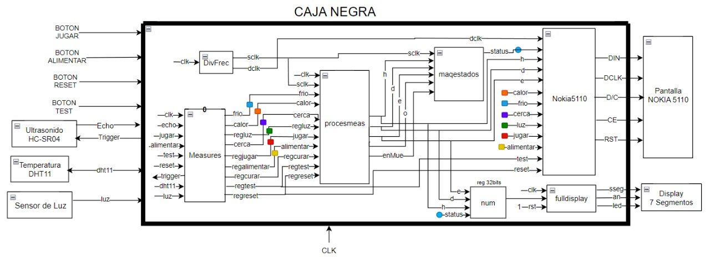
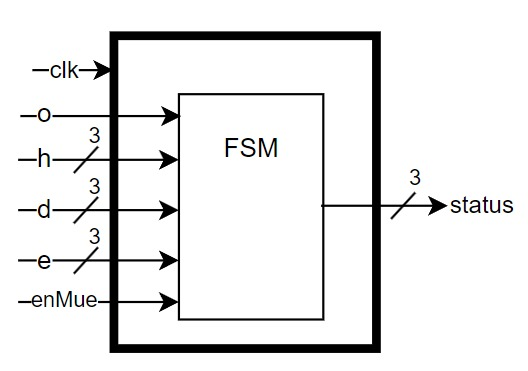
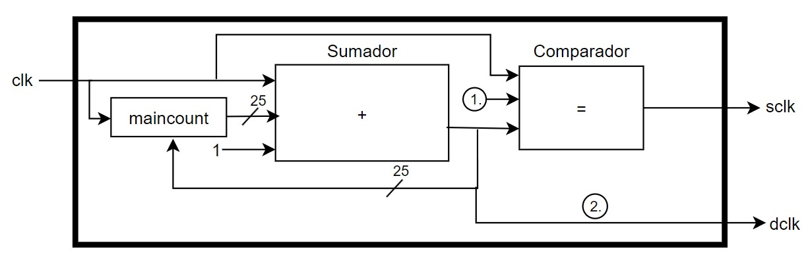
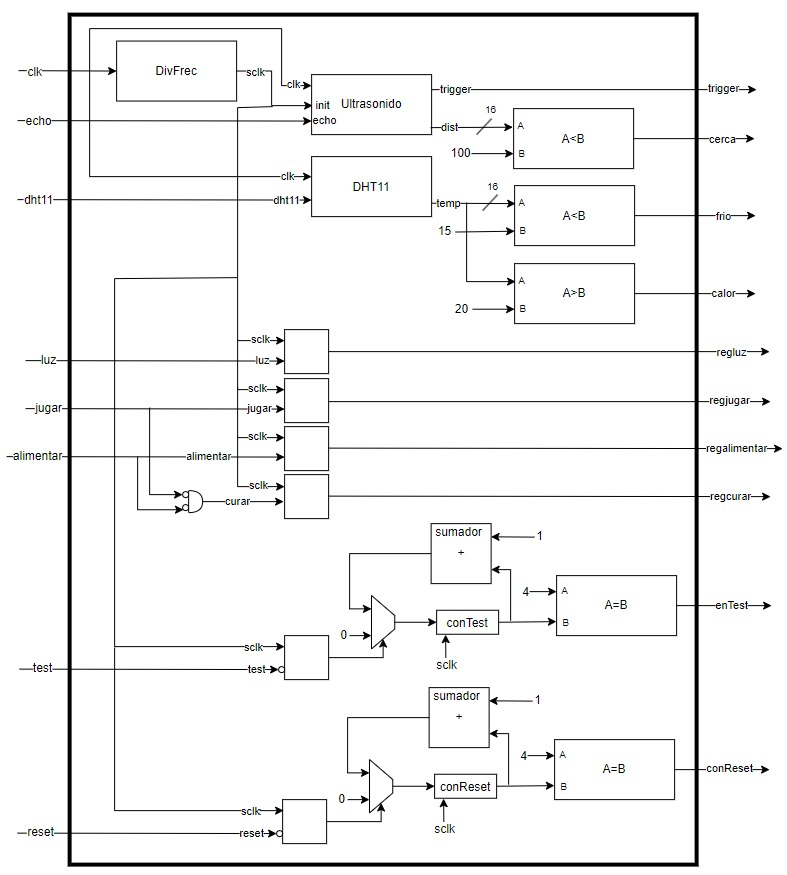
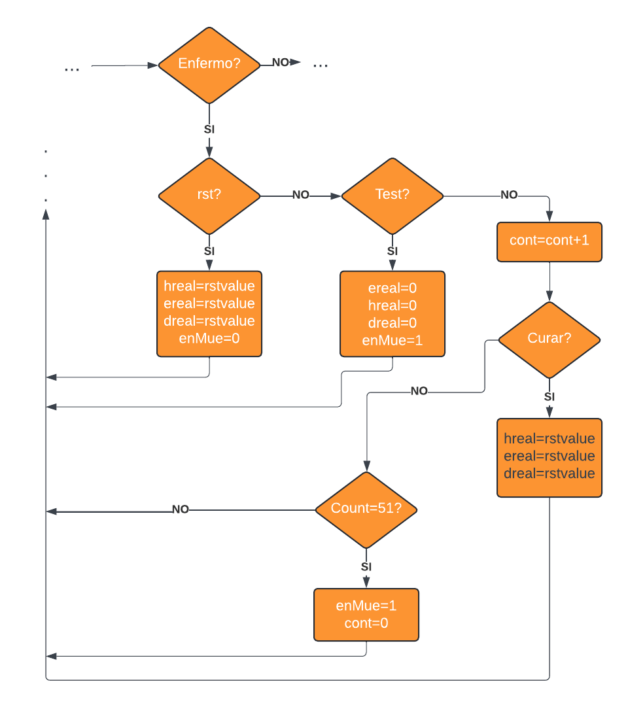
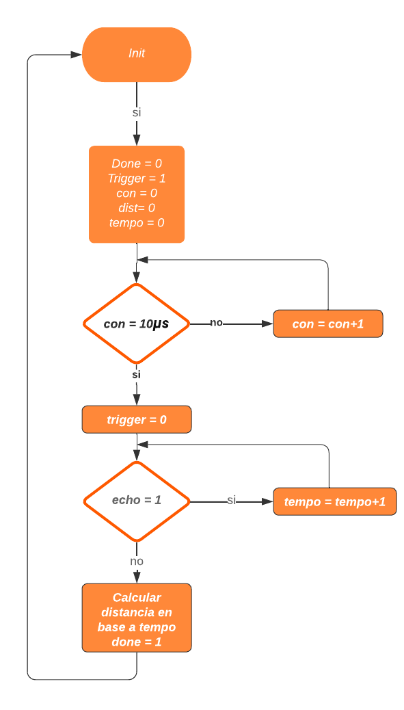
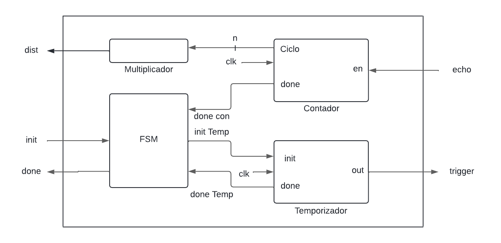

# Entrega 1 del proyecto WP01

### Integrantes:
- Jose Gabriel Peña Solorzano
- Cristian Camilo Barbosa Suarez
- Gabriel Felipe Ostos Iguavita

# Objetivo

Desarrollar un sistema de Tamagotchi en FPGA (Field-Programmable Gate Array) que simule el cuidado de una mascota virtual. El diseño incorporará una lógica de estados para reflejar las diversas necesidades y condiciones de la mascota, junto con mecanismos de interacción a través de sensores y botones que permitan al usuario cuidar adecuadamente de ella.

# 1. Requisitos del sistema

## 1.1 Botones

Planteamos el uso de los siguientes botones para interactuar con el sistema:

- **Reset:** Configura los valores de la mascota en un estado inicial "Feliz" que refleja condiciones optimas y define las variables de diversión, hambre y energia en un valor de 4. Esto se establece luego de pulsar el respectivo boton por 5 segundos.
- **Test:** Activa el modo de prueba al mantener pulsado por al menos 5 segundos, permitiendo al usuario navegar entre los diferentes estados del Tamagotchi con cada pulsación.
- **Jugar:** Simula jugar con la mascota virtual, por lo tanto con una pulsacion aumenta el valor de "Diversion" y disminuye el valor correspondiente a "Energia", simulando cansancio en la mascota.
- **Alimentar:** Simula suministrar alimento a la mascota, por lo que al pulsar el boton aumenta el valor correspondiente a "Hambre", lo que se explica más adelante. 
- **Curar:** Para simular esta acción en la mascota, proponemos pulsar los botones de "Jugar" y "Alimentar" de manera simultanea. La acción de curar solo debe ser posible en el estado "enfermo" y se asemeja al reset en que define las variables de "diversión", "hambre" y "energia" en un valor de 4.

## 1.2 Sistema de Sensado

Para la interacción de Tamagutchi con su entorno, se propone incorporar 3 sensores como lo son:

- **Sensor de Luz o Fotoresistencia:** Este sensor nos permite determinar los tiempos en que la mascota estara descansando, si es sometido a luz el Tamagutchi estara despierto, en caso contrario, si esta oscuro o bajo sombra estará dormido. 

- **Sensor Ultrasonido(HC-SR04):** Con este sensor queremos interactuar con el Tamagutchi para cambiar su nivel de "Diversión", si nos ubicamos cerca a la mascota el valor de este item debe conservarse, de lo contrario disminuirá progresivamente.

- **Sensor de Temperatura(DHT11)** Usando este sensor se pueden modificar los niveles de "Hambre" y de "Energia", si la temperatura es muy baja el Tamagutchi sufrirá disminución en su nivel de "Hambre", mientras que si se encuentra a altas temperaturas, la mascota tendra disminución en su valor de "Energia" reflejando cansancio.

## 1.3 Sistema de Visualizacion

Para la visualización del Tamagutchi, la representacion de sus emociones, de sus interacciones y los valores numéricos representativos de los estados se empleará el display "Nokia 5110", esto permite al usuario entender las necesidades de la mascota virtual y actuar para su bienestar. Ademas se implementa el display 7 segmentos dispuesto en la FPGA para visualizar el estado y el nivel de las emociones.

# 2. Especificaciones de Diseño

## 2.1 Estados

El Tamagutchi posee la siguiente lógica de estados que representan sus condiciones y necesidades. Los estados son los siguientes:

| **Estado** | **Binario** | **Decimal** |  
|:----------:|:-----------:|:-----------:|
|    Feliz   |     000     |      0      |
|  Aburrido  |     001     |      1      |
|   Cansado  |     010     |      2      |
| Descansando |     011     |      3      |
| Hambriento |     100     |      4      |
|   Enfermo  |     101     |      5      |
|   Muerto   |     110     |      6      |

## 2.2 Variables de transición de estados

Para controlar los cambios de estado definimos las siguientes variables:

- **Diversion(d):** Representa el nivel de diversión de la mascota en una escala de 0 a 5 donde 5 es entretenida y 1 es aburrida. Esta variable aumenta jugando con el tamagutchi; disminuye tras pasar el tiempo sin interactuar con la mascota y se conserva si el usuario le da compañia a la mascota.
- **Hambre(h):** Representa el nivel de hambre de la mascota en una escala de 0 a 5 donde 5 es llena y 1 es hambrienta. Esta variable aumenta alimentando al tamagutchi y disminuye con el tiempo, aumentando la velocidad de disminución en un ambiente frio.
- **Energia(e):** Representa el nivel de energia de la mascota en una escala de 0 a 5 donde 5 es activa y 1 es cansada. Esta variable aumenta con el tiempo mientras el tamagutchi esta en estado "descansando" y disminuye con el tiempo. La velocidad de disminución de esta variable aumenta al jugar con el tamagutchi, en un ambiente caluroso o en un ambiente oscuro.
  
Para las 3 variables ya mencionadas, un nivel de 5, 4 o 3 se consideran optimos y mantienen a la mascota en estado "feliz"; un nivel de 2 o 1 implican una necesidad y fuerzan un cambio de estado según el caso; 0 representa un estado crítico y fuerza a la mascota a pasar a estado "enfermo".

- **Oscuridad(o):** Solo pudiendo tomar valores entre 0 y 1 según el nivel de luz del ambiente. En un estado de "cansado", la oscuridad permite al tamagotchi pasar a estado "descansar". Si la mascota aun tiene energia, aumenta la velocidad de disminución de "energía" para permitirle al tamagotchi descansar.

- **enMue:** Solo toma valores entre 0 y 1 segun el tiempo que haya pasado la mascota en enfermo. Esta variable se tiene en cuenta unicamente en el estado de "enfermo" y permite el paso a "muerto" si la mascota no es curada.

## 2.3 Acciones/Interacciones:

- **Jugar:** Permite aumentar Diversion pero disminuye Energia.
- **Alimentar:** Disminuye Hambre.
- **Curar:** Permite fijar Diversion, Hambre y Energia en un valor de 4.
- **Luz:** Permite entrar al estado Descansando y disminuye la Energia.
- **Proximidad:** Evita la disminucion de Diversion.
- **Temperatura:** Disminuye la Energia o Hambre segun sea el caso.

## 2.4 Descripcion de estados

A continuación se presentan todos los estados del tamagutchi, con sus respectivas descripciones, condiciones y limitaciones de interacción, es decir, que acciones no se pueden realizar/no se tienen en cuenta en cada estado.

- **Feliz:** Representa el bienestar de la mascota. Implica que las variables diversion, hambre y energia esten todas en un nivel de 3 o superior. En este estado se ignora la accion de Curar.
- **Aburrido:** Representa falta de diversion en la mascota. Implica que el hambre y la energia tengan un nivel de 3 o superior, pero que la diversión este en 2 o en 1. En este estado se ignora la accion de Curar.
- **Cansado:** Representa falta de descanso en la mascota. Implica hambre en un nivel igual o superior a 3, pero de energía en 2 o 1. En este estado se ignoran las acciones de Curar y Jugar.
- **Descansando:** Representa a la mascota dormida. Implica energia en un nivel de 2 o 1 y que el ambiente este oscuro. En este estado se ignoran las acciones de Jugar, Alimentar, Curar ,Proximidad y Temperatura.
- **Hambriento:** Representa falta de alimentación en la mascota. Implica un nivel de hambre de 1 o 2. Ignora las acciones de Curar, Jugar, Oscuridad.
- **Enfermo:** Representa carencia en cualquiera de las necesitades de la mascota. Implica Diversion, Hambre o Energia en un nivel de 0 0.En este estado se ignoran las acciones de Jugar y Alimentar.
- **Muerto:** Luego de cierto tiempo enfermo sin curar a la mascota, esta morirá. En este estado se ignoran todas las acciones, solo siendo posible resetear el tamagutchi.

Notese que existe una jerarquia de necesidades, siendo posible pasar a "hambriento" sin importar el nivel de energia y diversión, permitiendo simplificar la máquina de estados. Esto se ve con mayor claridad en el diagrama de la máquina de estados.

# 3. Arquitectura del sistema

## 3.1 Diagramas de bloques

### 3.1.1 Diagrama general de caja negra

La imagen muestra el diagrama de una caja negra que representa el sistema del Tamagotchi. En el diagrama, se observan varios bloques conectados entre sí que conforman los diferentes módulos y sensores del dispositivo. La caja negra recibe entradas desde botones físicos, como "JUGAR", "ALIMENTAR", "RESET", y "TEST", así como de sensores como un sensor ultrasonido HC-SR04, un sensor de temperatura DHT11 y un sensor de luz. Dentro de la caja negra, se incluyen los módulos de procesamiento, como el módulo "Measures", que recibe señales de los sensores y botones, y el módulo "procesmeas", que realiza un procesamiento adicional de las medidas. También se encuentra un módulo "maqestados" encargado de la lógica de estados del sistema.

El sistema genera salidas hacia una pantalla Nokia 5110 mediante su respectivo controlador. Además, se cuenta con un controlador de display de 7 segmentos que permite ver el estado y el valor de las variables del sistema. Todos los módulos y dispositivos están sincronizados por una señal de reloj (CLK) y otros controladores como "DivFrec" que dividen la frecuencia de reloj para su correcto funcionamiento. Este diseño permite la interacción del usuario con el Tamagotchi a través de sensores y botones, mostrando el estado de la mascota en la pantalla y en los displays visuales.

### 3.1.2 Maquina de estados principal (maqestados)

Recordando que:
- Diversión(d)
- Hambre(h)
- Energia(e)
- Oscuridad(o)

Se aclara además que los botones Test y Reset controlan indirectamente los estados variando unicamente los valores de d, h y e; en vez del estado en sí mismo.

La máquina de estados trabaja 

### 3.1.3 Módulo divisor de frecuencia (DivFrec)

### 3.1.4 Módulo de toma de mediciones (measure)

Este módulo esta controlado por sclk. Inicializa los sensores y registra sus valores para ser trabajados posteriormente. En el caso de test y reset, solo saca señales de control de tamagotchi cuando los respectivos pulsadores se mantienen presionados por aproximadamente 5 segundos.

### 3.1.5 Procesamiento de mediciones (procesmeas)

Este módulo actualiza valores internos de h, e y d (hreal, ereal y dreal) en base al estado actual y las entradas (sensores y pulsadores) del tamagotchi.

Es necesario hacer una distinción entre h, e y d como registros de 6 posibles valores que representan visualmente el nivel del tamagotchi con hreal, ereal y dreal, que son registros de 8 bits (256 valores) que varian cada ciclo de operación del tamagotchi según las condiciones que este experimente.

Cada ciclo estos registros pueden subir, bajar, forzarse en un valor de reset específico o conservarse en sus valores máximos o mínimos para evitar saturaciones en los registros, que pueden desembocar en que la mascota muera de hambre tras alimentarse demasiado.

**Caso enfermo**

## 3.2 Descripcion de componentes

## Subsistemas

### Contador

- **Input:** Clk, enable.
- **Output:** Done, ciclo.

**Especificaciones:**

- Cuenta los ciclos de reloj durante los cuales enable = 1.
- Conserva el dato durante enable = 0.
- Parametro con n cantidad de bits para la salida.

**Maquina de estados:**

### Temporizador

- **Input:** Clk, Init.
- **Output:** Out, Done.
- **Param:** Ciclos.

**Especificaciones:**

- Out es 1 por la cantidad de ciclos especificados al instanciar cada vez que Init = 1.

**Maquina de estados:**

### Divisor de Frecuencia
- **Input:** Clk.
- **Output:** Sclk, Dclk.

**Especificaciones:**

- Sclk debe ser una señal periodica de frecuencia ajustable que tenga una duración corta en alto y larga en bajo, para controlar y coordinar la toma de mediciones de los sensores.
- Dclk debe ser una señal de reloj con frecuencia inferior a 4MHz (especificaciones de la pantalla Nokia5110).

## Ultrasonido(HC-SR04)

- **Input:** Trigger.
- **Output:** Echo.
- **Rango:** 20mm

**Trabajo:**

1. Recibe una senal de trigger en alto por 10us.
2. Realiza la medicion.
3. Envia una senal en alto por echo cuya duracion es proporcional a la distancia medida.

**Especificaciones del driver:**

- Debe tener senales de init y done para facilitar la implementacion.
- Cuando init = 1, realiza una medicion.
- Done = 1 cuando haya terminado de enviar la distancia.
- Como salida entrega el valor de distancia medido en mm y lo guarda hasta que init vuelva a ser 1.

**Maquina de estados:**

**Diagrama de flujo:**

**Diagrama de caja negra:**

**Implementacion:**

1. Distancia critica: 10cm

## Temperatura(DHT11)

- **Inout:** Data
- **Rango:** 0°-50°C

**Trabajo:**

1. Inicializacion

* Master manda un bajo por 18us
* Pull up por 20-40uS
* Slave manda un bajo por 80us 
* Pull up por 80uS

2. Medición

3. Transmisión de datos

* Antes de cada bit, slave manda un bajo por 5Ous 
* 0: un pull up por 26-28us
* 1: un pull up pur 70us

4. Slave manda un bajo por 50us al acabar la transmisión de datos

**Especificaciones del driver:**

* Debe tener init y done para facilitar la implementacion.
* Temperatura como salida con el valor de la temperatura en °C y lo guarda hasta init = 1.

**Implementacion:**

1.Temperatura critica superior: 20°C \
2.Temperatura critica inferior: 15°C

## Sensor de luz (módulo sensor de luz)
- **In:** Data

**Trabajo:**

Este sensor no requiere un driver debido a que el módulo físico ya transmite una señal de un bit según lo que reciba el sensor. La sensibilidad del sensor se puede ajustar con un potenciometro que hace perte del módulo.

## Pantalla(NOKIA 5110)

- **Output:** SDIN = Data, SCLK, D/C = Data/Command, SCE = Chip Enable, RST = Reset,  VLCD = 5Vdc.

**Trabajo:**

* El control de la pantalla consiste, de forma muy general, en el uso conjunto de tres pines: Din: con el que la pantalla recibe información de forma serial, DC: que define si esta información corresponde a un comando (DC=0) o a un dato de "pintura" de pixeles (DC=1) y CE: que habilita, al ponerse en bajo, la recepción de datos. 

* El protocolo de comunicación es SPI. Es necesario enviarle a la pantalla serialmente "paquetes" de 8 bits (bytes) a través de DIN, esto implica que la pintura de la pantalla no se hace bit a bit sino byte a byte. Así pues, cambiar un pixel de la pantalla requiere considerar los demás 7 bits que componen el byte.

* Si bien se puede mandar uno o múltiples bytes cada vez que se pone CE en bajo, la pantalla espera recibir serialmente un número de bits que sea múltiplo de 8. Si se interrumpe el envío del byte, la pantalla asumirá que los primeros bits al retomar el proximo envio corresponden a los bytes faltantes del envio interrumpido.

* Para la inicialización del periferico es necesario enviar una señal en bajo por RST a la vez que se envia una señal en bajo por CE. Tras esta operación, el pin RST sirve para cancelar el envio del byte en caso de errores.

* Adicionalmente, la señal de clk con la que se trabaja en la pantalla no debe superar los 4MHz. La pantalla toma en los flancos positivos de clk el valor de DIN, por lo que se recomienda realizar los cambios en este pin durante los flancos negativos de clk.

* Finalmente, cabe aclarar que existen versiones de este periferico que solo funcionan con un 1 lógico de 5V, por lo que para acoplarlo a la fpga puede ser necesario el uso de conversores de nivel lógico.

**Especificaciones del driver:**

* La pantalla debe mostrar el nivel de energia, hambre y diversion del tamagotchi con el formato: Letra que represente la variable, dos puntos, nivel de la variable, dos puntos, nivel de la variable en forma de número. Por ejemplo: E : 3, correspondiente al nivel de energia igual a 3.

* Debe mostrar explicitamente el estado del tamagotchi en la zona superior.

* La mascota debe tener caracteristicas visuales únicas para reflejar el estado en el que este.

**Maquina de estados:**

**Explicación de diseño**

Para trabajar la pantalla se utiliza un registro de 4064 bits llamado "write" donde se asignarán los valores a enviar según las entradas del driver, asi como un registro de 508 (4064/8) bits "writedc" con la secuencia correspondiente a la naturaleza de cada byte enviado, es decir, cuales bytes en write corresponden a un comando y cuales a valores de pintura.

Adicionalmente, se pueden ver parametros con los valores escritos en hexadecimal que representan las secuencias para el pintado de algunos símbolos importantes como numeros, testigos para los sensores y pulsadores del sistema, los nombres de los estados posibles del tamagotchi o el propio cuerpo de la mascota y sus posibles variaciones para expresar las necesidades que sienta.

En el estado de RESET se realiza la inicialización de la pantalla y se asignan unos valores iniciales a write para la configuración general de la pantalla. Gracias a la propiedad de que tanto write como writedc empizan con todos sus valores en 0 y el hecho de que el comando "h00" se define en el datasheet de la pantalla como un comando que no tiene efecto sobre esta, solo hay necesidad de asignar unos pocos bytes a write para efectuar correctamente la configuración de la pantalla.

El estado SEND envia bit por bit, iniciando por el MSB, los valores en write y en writedc, utilizando contadores para coordinar el envio, realizando corrimientos a write cada ciclo de reloj, a writedc cada ocho ciclos y asignando los MSB de ambos registros a su respectivo puerto de salida.

Se agrega ademas un estado WAIT que se encarga de esperar unos pocos ciclos entre los estados de SEND y IDLE. Este estado es un vestigio de una primera versión del módulo que trataba el envio de cada byte dentro de su propio submodulo, en esta versión era necesario un estado de espera entre el envio de bytes puesto que tocaba actulizar el byte a enviar y deshabilitar el envio de datos para conservar la coordinación del sistema. Es necesario reconocer que este es potencialmente un estado redundante en el diseño implementado finalmente, sin embargo nunca realizamos pruebas omitiendolo y optamos por dejarlo.

Finalmente, en el estado de IDLE se asignan los valores de write y writedc mientras se espera al siguiente envío.

Cabe destacar que existen bits en write que llamamos "estaticos", es decir, bits de comando o pintura que se conservan en todos los estados del tamagotchi. Un ejemplo de bits estaticos serían los asociados a la pintura de la palabra "tamagotchi", puesto que este mensaje siempre se muestra en la pantalla. writedc es en sí mismo un estatico, ya que la secuencia de comandos y pintura no cambia.

Los bits dinamicos de write son espacios que dependen de las entradas del driver. Un ejemplo de bits dinamicos serían los que corresponden a los pixeles de la pantalla que imprimen el valor númerico de h, ya que este puede tener 5 posibles valores. Se puede ver entonces que se reescriben los mismos bits del registro write entre los diferentes parametros asociados a cada número según la entrada h, la dirección de estos bits reescritos corresponden a cuales bits de la totalidad del envío corresponden al valor numerico de h.

Dada la forma en la que se implementó el driver de la pantalla se puede intuir el siguiente problema: asignar las direcciones en la memoria de write según el orden en que cada comando/simbolo tiene lugar en la totalidad del envío. Para esto, se consideró que la pantalla naturalmente va pintando bytes verticales de izquierda a derecha y de arriba a abajo y se asignaron a mano las direcciones en base al documento Orden que se puede encontrar en la carpeta tamagotchi del repositorio. Este orden nace a su vez del diseño realizado en pixilart.com que se puede visualizar abriendo el documento tamagotchiDiseño.pixil en dicha pagina web.

Por último, cabe aclarar que el ultimo byte del envio es un dinamico que depende de si el sistema percibe oscuridad y consiste de un comando que niega todos los pixeles de la pantalla. Asimismo, los primeros tres bytes del envio corresponden a los comandos: poner la pantalla en modo normal (por si estaba negada) y asignar el cursor de pintura en el byte (0,0) de la pantalla. Los demas bytes son de pintura; dado que la pantalla no tiene un comando para limpiar su memoria interna, es necesario limpiarla pintando activamente espacios en blanco.

# 4. Implementacion final

El codigo verilog implementado para el desarrollo del prototipo final de la mascota se encuentra en la carpeta **tamagotchi**.

# Funcionamiento fisico

