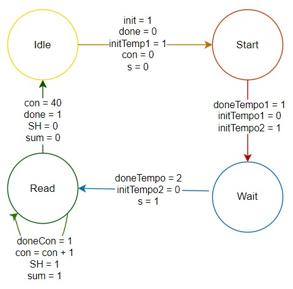

# Entrega 1 del proyecto WP01

### Integrantes:
- Jose Gabriel Peña Solorzano
- Cristian Camilo Barbosa Suarez
- Gabriel Felipe Ostos Iguavita

# Objetivo

Desarrollar un sistema de Tamagotchi en FPGA (Field-Programmable Gate Array) que simule el cuidado de una mascota virtual. El diseño incorporará una lógica de estados para reflejar las diversas necesidades y condiciones de la mascota, junto con mecanismos de interacción a través de sensores y botones que permitan al usuario cuidar adecuadamente de ella.

# 1. Requisitos del sistema

## 1.1 Botones

Planteamos el uso de los siguientes botones para interactuar con el sistema:

- **Reset:** Configura los valores de la mascota en un estado inicial "Feliz" que refleja condiciones optimas y define las variables de diversión, hambre y energia en un valor de 4. Esto se establece luego de pulsar el respectivo boton por 5 segundos.
- **Test:** Activa el modo de prueba al mantener pulsado por al menos 5 segundos, permitiendo al usuario navegar entre los diferentes estados del Tamagotchi con cada pulsación.
- **Jugar:** Simula jugar con la mascota virtual, por lo tanto con una pulsacion aumenta el valor de "Diversion" y disminuye el valor correspondiente a "Energia", simulando cansancio en la mascota.
- **Alimentar:** Simula suministrar alimento a la mascota, por lo que al pulsar el boton aumenta el valor correspondiente a "Hambre", lo que se explica más adelante. 
- **Curar:** Para simular esta acción en la mascota, proponemos pulsar los botones de "Jugar" y "Alimentar" de manera simultanea. La acción de curar solo debe ser posible en el estado "enfermo" y se asemeja al reset en que define las variables de "diversión", "hambre" y "energia" en un valor de 4.

## 1.2 Sistema de Sensado

Para la interacción de Tamagutchi con su entorno, se propone incorporar 3 sensores como lo son:

- **Sensor de Luz o Fotoresistencia(GL5516):** Este sensor nos permite determinar los tiempos en que la mascota estara descansando, si es sometido a luz el Tamagutchi estara despierto, en caso contrario, si esta oscuro o bajo sombra estará dormido. 

- **Sensor Ultrasonido(HC-SR04):** Con este sensor queremos interactuar con el Tamagutchi para cambiar su nivel de "Diversión", si nos ubicamos cerca a la mascota el valor de este item debe conservarse, de lo contrario disminuirá progresivamente.

- **Sensor de Temperatura(DHT11)** Usando este sensor se pueden modificar los niveles de "Hambre" y de "Energia", si la temperatura es muy baja el Tamagutchi sufrirá disminución en su nivel de "Hambre", mientras que si se encuentra a altas temperaturas, la mascota tendra disminución en su valor de "Energia" reflejando cansancio.

## 1.3 Sistema de Visualizacion

Para la visualización del Tamagutchi, la representacion de sus emociones y los valores numéricos representativos de los estados se empleará el display "Nokia 5110", esto permite al usuario entender las necesidades de la mascota virtual y actuar para su bienestar.

# 2. Especificaciones de Diseño

## 2.1 Estados

El Tamagutchi posee la siguiente lógica de estados que representan sus condiciones y necesidades. Los estados son los siguientes:

| **Estado** | **Binario** | **Decimal** |  
|:----------:|:-----------:|:-----------:|
|    Feliz   |     000     |      0      |
|  Aburrido  |     001     |      1      |
|   Cansado  |     010     |      2      |
| Descansando |     011     |      3      |
| Hambriento |     100     |      4      |
|   Enfermo  |     101     |      5      |
|   Muerto   |     110     |      6      |

## 2.2 Variables de transición de estados

Para controlar los cambios de estado definimos las siguientes variables:

- **Diversion(d):** Representa el nivel de diversión de la mascota en una escala de 0 a 5 donde 5 es entretenida y 1 es aburrida. Esta variable aumenta jugando con el tamagutchi; disminuye tras pasar el tiempo sin interactuar con la mascota y se conserva si el usuario le da compañia a la mascota.
- **Hambre(h):** Representa el nivel de hambre de la mascota en una escala de 0 a 5 donde 5 es llena y 1 es hambrienta. Esta variable aumenta alimentando al tamagutchi y disminuye con el tiempo, aumentando la velocidad de disminución en un ambiente frio.
- **Energia(e):** Representa el nivel de energia de la mascota en una escala de 0 a 5 donde 5 es activa y 1 es cansada. Esta variable aumenta con el tiempo mientras el tamagutchi esta en estado "descansando" y disminuye con el tiempo. La velocidad de disminución de esta variable aumenta al jugar con el tamagutchi, en un ambiente caluroso o en un ambiente oscuro.
  
Para las 3 variables ya mencionadas, un nivel de 5, 4 o 3 se consideran optimos y mantienen a la mascota en estado "feliz"; un nivel de 2 o 1 implican una necesidad y fuerzan un cambio de estado según el caso; 0 representa un estado crítico y fuerza a la mascota a pasar a estado "enfermo".

- **Oscuridad(o):** Solo pudiendo tomar valores entre 0 y 1 según el nivel de luz del ambiente. En un estado de "cansado", la oscuridad permite al tamagotchi pasar a estado "descansar". Si la mascota aun tiene energia, aumenta la velocidad de disminución de "energía" para permitirle al tamagotchi descansar.

## 2.3 Acciones/Interacciones:

- **Jugar:** Permite aumentar Diversion pero disminuye Energia.
- **Alimentar:** Disminuye Hambre.
- **Curar:** Permite fijar Diversion, Hambre y Energia en un valor de 4.
- **Luz:** Permite entrar al estado Descansando y disminuye la Energia.
- **Proximidad:** Evita la disminucion de Diversion.
- **Temperatura:** Disminuye la Energia o Hambre segun sea el caso.

## 2.4 Descripcion de estados

A continuación se presentan todos los estados del tamagutchi, con sus respectivas descripciones, condiciones y limitaciones de interacción, es decir, que acciones no se pueden realizar/no se tienen en cuenta en cada estado.

- **Feliz:** Representa el bienestar de la mascota. Implica que las variables diversion, hambre y energia esten todas en un nivel de 3 o superior. En este estado se ignora la accion de Curar.
- **Aburrido:** Representa falta de diversion en la mascota. Implica que el hambre y la energia tengan un nivel de 3 o superior, pero que la diversión este en 2 o en 1. En este estado se ignora la accion de Curar.
- **Cansado:** Representa falta de descanso en la mascota. Implica hambre en un nivel igual o superior a 3, pero de energía en 2 o 1. En este estado se ignoran las acciones de Curar y Jugar.
- **Descansando:** Representa a la mascota dormida. Implica energia en un nivel de 2 o 1 y que el ambiente este oscuro. En este estado se ignoran las acciones de Jugar, Alimentar, Curar ,Proximidad y Temperatura.
- **Hambriento:** Representa falta de alimentación en la mascota. Implica un nivel de hambre de 1 o 2. Ignora las acciones de Curar, Jugar, Oscuridad.
- **Enfermo:** Representa carencia en cualquiera de las necesitades de la mascota. Implica Diversion, Hambre o Energia en un nivel de 0 0.En este estado se ignoran las acciones de Jugar y Alimentar.
- **Muerto:** Luego de cierto tiempo enfermo sin curar a la mascota, esta morirá. En este estado se ignoran todas las acciones, solo siendo posible resetear el tamagutchi.

Notese que existe una jerarquia de necesidades, siendo posible pasar a "hambriento" sin importar el nivel de energia y diversión, permitiendo simplificar la máquina de estados. Esto se ve con mayor claridad en el diagrama de la máquina de estados.

# 3. Arquitectura del sistema

## 3.1 Descripcion de componentes

## Subsistemas

### Contador

- **Input:** Clk, enable.
- **Output:** Done, ciclo.

**Especificaciones:**

- Cuenta los ciclos de reloj durante los cuales enable = 1.
- Conserva el dato durante enable = 0.
- Parametro con n cantidad de bits para la salida.

**Maquina de estados:**

### Temporizador

- **Input:** Clk, Init.
- **Output:** Out, Done.
- **Param:** Ciclos.

**Especificaciones:**

- Out es 1 por la cantidad de ciclos especificados al instanciar cada vez que Init = 1.

**Maquina de estados:**

## Ultrasonido(HC-SR04)

- **Input:** Trigger.
- **Output:** Echo.
- **Rango:** 20mm

**Trabajo:**

1. Recibe una senal de trigger en alto por 10us.
2. Realiza la medicion.
3. Envia una senal en alto por echo cuya duracion es proporcional a la distancia medida.

**Especificaciones del driver:**

- Debe tener senales de init y done para facilitar la implementacion.
- Cuando init = 1, realiza una medicion.
- Done = 1 cuando haya terminado de enviar la distancia.
- Como salida entrega el valor de distancia medido en mm y lo guarda hasta que init vuelva a ser 1.

**Maquina de estados:**

**Diagrama de flujo:**

**Diagrama de caja negra:**

**Bloque de implementacion:**

1. Distancia critica

## Temperatura(DHT11)

- **Inout:** Data
- **Rango:** 0°-50°C

**Trabajo:**

1. Inicializacion

* Master manda un bajo por 18us
* Pull up por 20-40uS
* Slave manda un bajo por 80us 
* Pull up por 80uS

2. Medición

3. Transmisión de datos

* Antes de cada bit, slave manda un bajo por 5Ous 
* 0: un pull up por 26-28us
* 1: un pull up pur 70us

4. Slave manda un bajo por 50us al acabar la transmisión de datos

**Especificaciones del driver:**

* Debe tener init y done para facilitar la implementacion.
* Temperatura como salida con el valor de la temperatura en °C y lo guarda hasta init = 1.

**Maquina de estados:**

**Diagrama de caja negra:**

**Bloque de implementacion:**

1.Temperatura critica superior \
2.Temperatura critica inferior

## Pantalla(NOKIA 5110)

- **Input:** SDIN = Data, SCLK, D/C = Data/Command, SCE = Chip Enable, RST = Reset, OSC = Oscillator, VLCD = 5Vdc.

**Especificaciones del driver:**

* La pantalla debe mostrar el nivel de energia, hambre y diversion del tamagotchi con el formato: Letra que represente la variable, dos puntos, nivel de la variable, dos puntos, nivel de la variable en forma de numero. Por ejemplo: E: 3, correspondiente al nivel de energia igual a 3.

* Debe mostrar explicitamente el estado del tamagotchi en la zona superior.

* La mascota debe tener caracteristicas visuales unicas para reflejar el estado en el que este.

## 3.2 Diagramas de bloques

### 3.2.1 Diagrama general de caja negra

### 3.2.2 Datapath

### 3.2.3 FSM1

Recordando que:
- Diversión(d)
- Hambre(h)
- Energia(e)
- Oscuridad(o)

### 3.2.4 FSM2

